<!--  -->

# <h1 align ="center"> [bekerja](https://www.boredduck.site/) </h1>

**bekerja** is a creative space for makers nestled in a simple yet inspiring garage workshop designed with a touch of minimalistic elegance. Bekerja offers a diverse array of facilities tailored to meet the needs of any aspiring craftsman or artisan.

## Web Preview

 Main page 

 

Expanded hamburger button

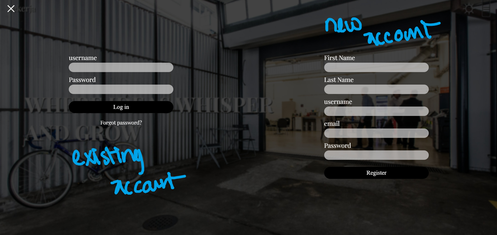

## Documentation

### Steps
<!-- 
 -->

1.  Make the concepts of what the layout is going to be.
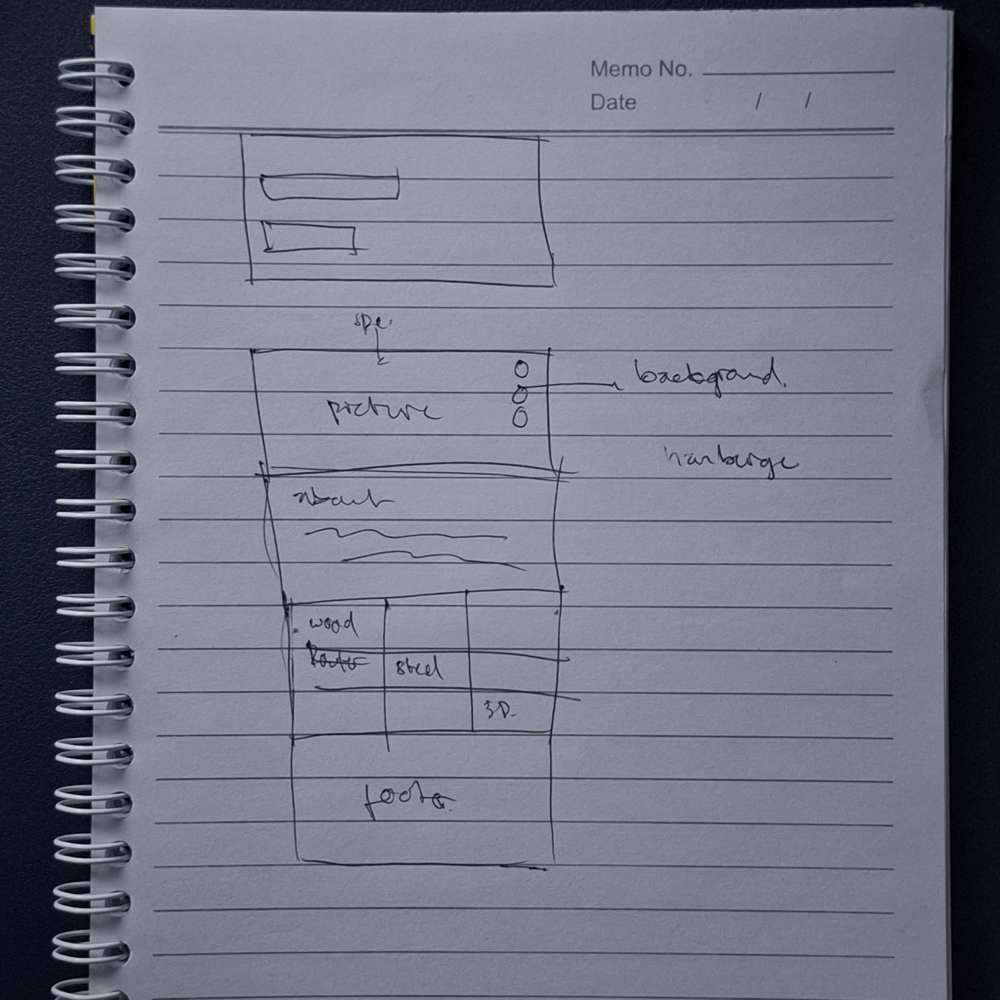

 

2. Create the basic html contents.
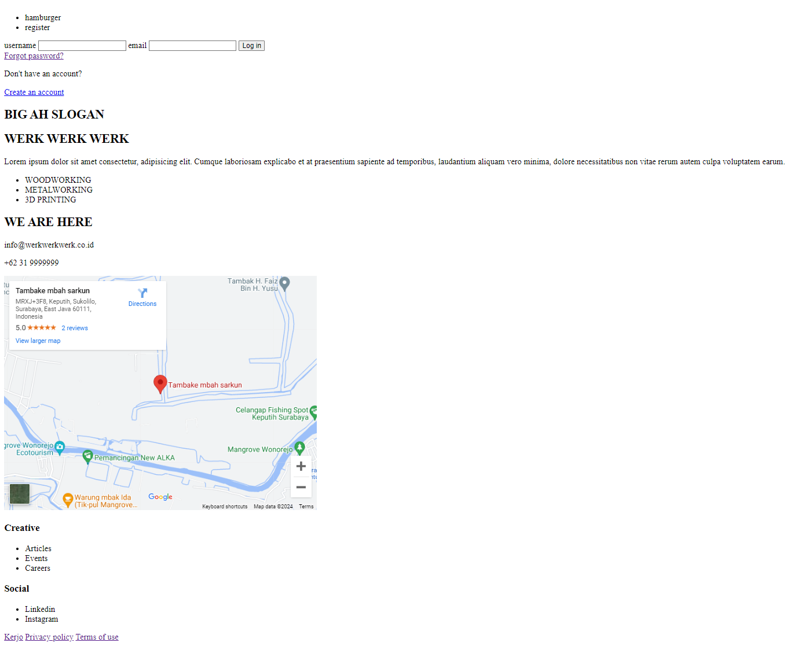

 

3. Set the basic layout appearances.
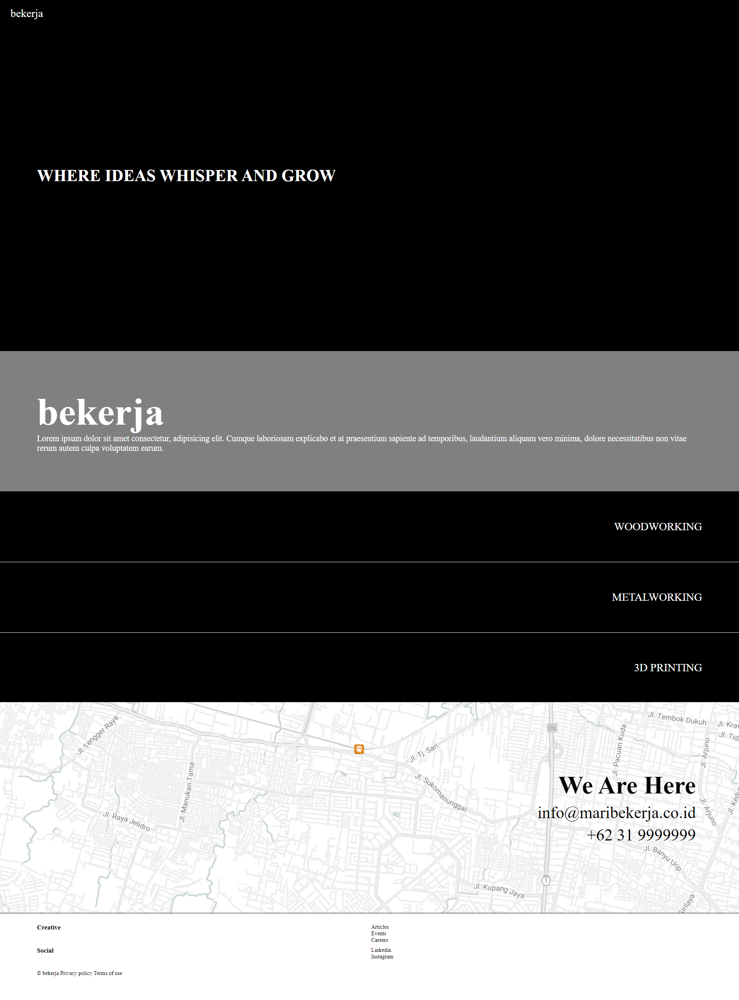

 

4. Add more contents and retouch the page.

   Embed **Playfair Display** font to add a bit of character to the text eventually also to the page itself.

   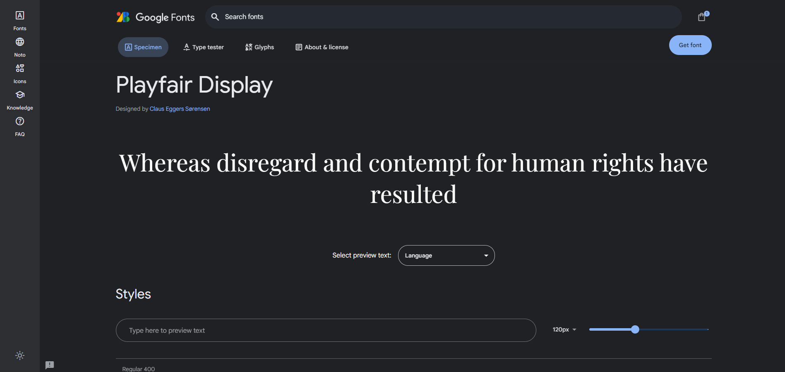

### Features
 
1. Algining the user form into a column direction on mobile page so the form still relatively maintains the size ratio.

   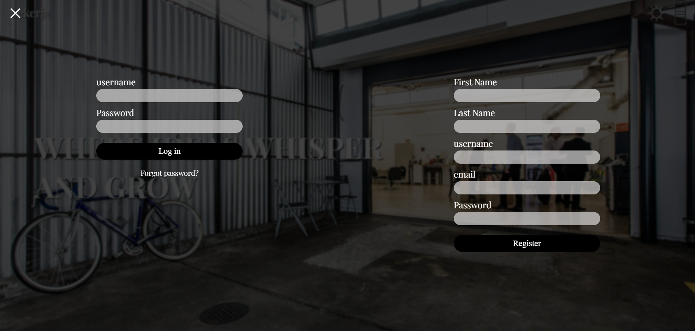

    Mobile phone display.

   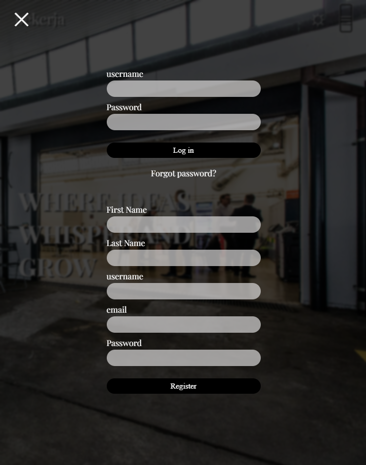

 

2. Create a 'highlight' when the cursor hovering the list by translating the background images off the screen and tone down the opacity of the unselected items.

   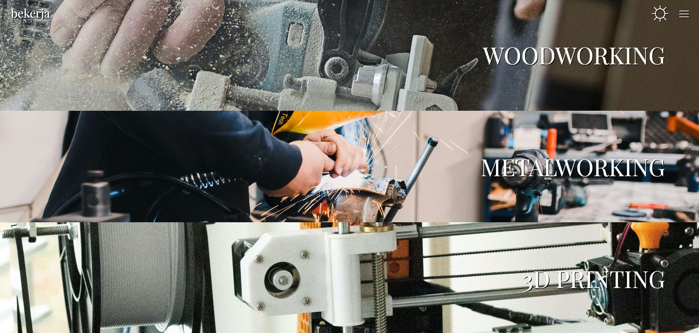

   Hovered on the METALWORKING item.

   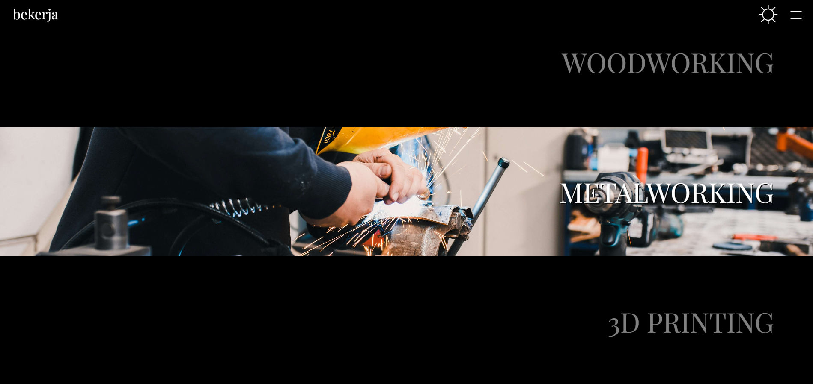

 

3. Showing the testimony text when the cursor hovering on the testimony section by trasnlating the image to the other side on the page.

   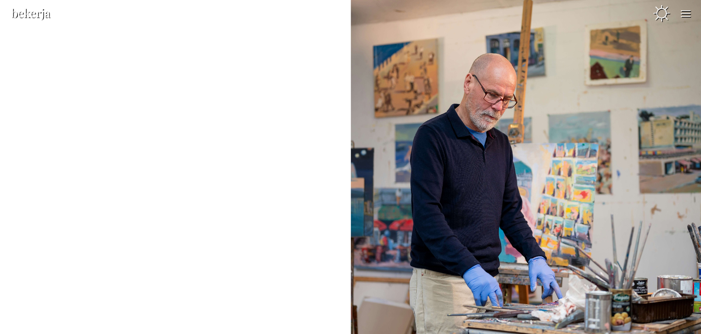
   
   The testimony being showed.

   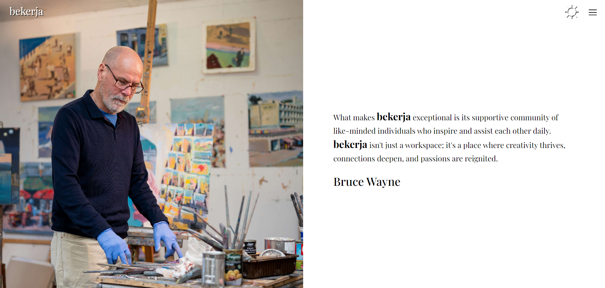

 

4. Changing the testimony layout on mobile display into column in order to make the text readable.

   
   
   The testimony being showed by trasnlating the image to the other side on the page.

   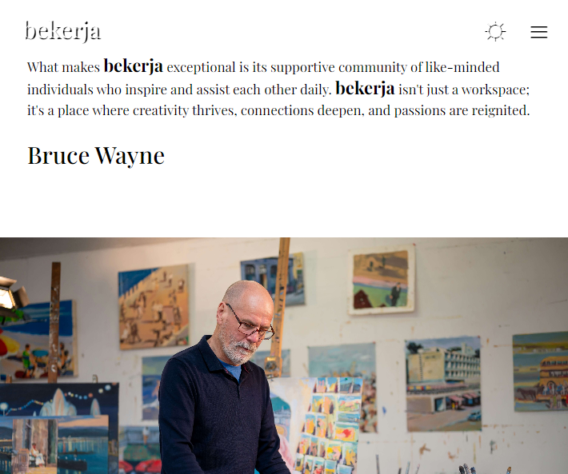

 

5. Show the bottom border line when the cursor hovering the item instead of underline. This makes the line's properties customizeable.

   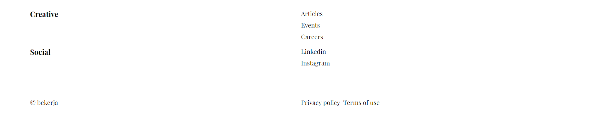
   
   Hovered on careers items

   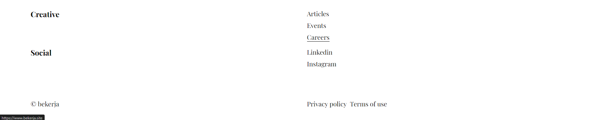

###